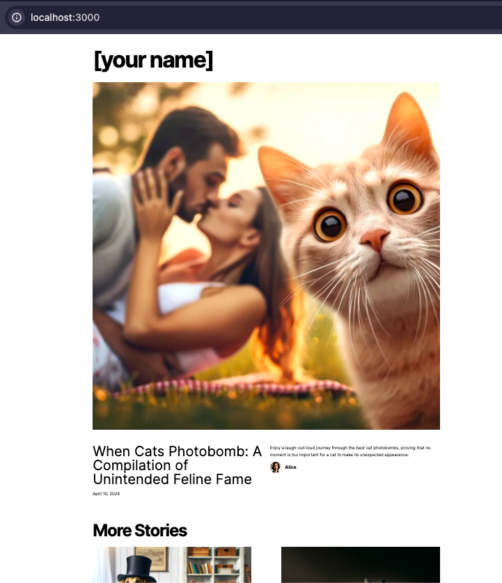

# Hack Your Future - Next.js + Contentful workshop

Welcome to the repo for this workshop!

## What we will talk about:

- What is a full-stack framework
- Next.js
- What are the different rendering strategies you can chose from (use cases and benefits):
  - Client Side Rendering (CSR)
  - Server Side Rendering (SSR)
  - Static Site Generation (SSG)
- Client Components and Server Components
- Brief intro to the concept of a CMS. We will specifically use Contentful for this project.

## What you should do before the workshop:

- [ ] Research Next.js default project structure (checkout the repo)
- [ ] Go through the [How to run the project](#how-to-run-the-project) and make sure to setup and run the app
- [ ] Research App router:
  - What is file-based routing?
  - Creating a new page
  - Creating dynamic pages
  - Linking between pages
- [ ] If you have never encountered Typescript yet, watch or read some brieft introduction to it

Don't worry if you don't have enough time to go through all of this content. We will do a quick refresher in the workshop.

The main focus of the workshop will be to introduce you to Next.js as a full-stack framework and focus on rendering strategies so you start grasping new and more advanced concepts that will help you in the future.
</br>
</br>

## How to run the project

Initial actions:
- `fork` the repository in GitHub
- `clone` the repository locally from your GitHub account to your machine

<br/>

1. Create a `.env.local` file at the root level and add the following environment variables:

```
CONTENTFUL_SPACE_ID=...
CONTENTFUL_ACCESS_TOKEN=...
CONTENTFUL_PREVIEW_ACCESS_TOKEN=...
```

The values for these variables will be provided in private through Slack. We are now a developer team and we don't post any secrets in public 😉


> This setup connects you to an already created Contentful account. If you want to create and use your own Contentful account to fetch content from, follow the dedicated guide [here](/README_configure_Contentful.md).
> <br/>
> Note that it is not required to have your own Contenful account (as you can utilize the already setup account) and it takes some effort to get it working, so evaluate your time and energy resources wisely.

2. After having setup the `.env.local` file, install dependencies and run the project:

```bash
npm install
npm run dev
```

<br/>

3. Change "Blog." that is visible in the homepage to your name, take a screenshot of the homepage, and post it in the workshop Slack channel.  
Example:



<br/>
<hr>
<br/>
Voilà! You are ready for the workshop! 💃🕺

